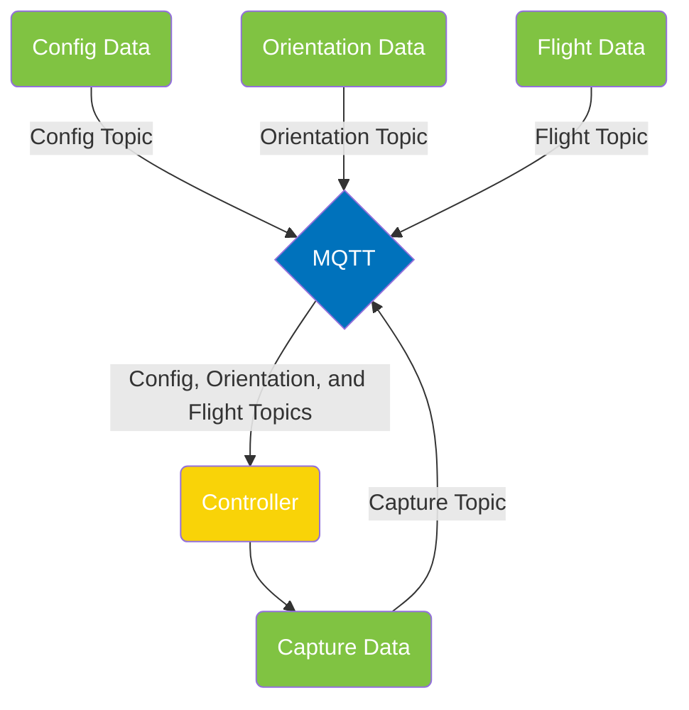

<a name="readme-top"></a>

[contributors-shield]: https://img.shields.io/github/contributors/IQTLabs/edgetech-template.svg?style=for-the-badge
[contributors-url]: https://github.com/IQTLabs/edgetech-template/graphs/contributors
[forks-shield]: https://img.shields.io/github/forks/IQTLabs/edgetech-template.svg?style=for-the-badge
[forks-url]: https://github.com/IQTLabs/edgetech-template/network/members
[stars-shield]: https://img.shields.io/github/stars/IQTLabs/edgetech-template.svg?style=for-the-badge
[stars-url]: https://github.com/IQTLabs/edgetech-template/stargazers
[issues-shield]: https://img.shields.io/github/issues/IQTLabs/edgetech-template.svg?style=for-the-badge
[issues-url]: https://github.com/IQTLabs/edgetech-template/issues
[license-shield]: https://img.shields.io/github/license/IQTLabs/edgetech-template.svg?style=for-the-badge
[license-url]: https://github.com/IQTLabs/edgetech-template/blob/master/LICENSE.txt
[product-screenshot]: images/screenshot.png
[python]: https://img.shields.io/badge/python-000000?style=for-the-badge&logo=python
[python-url]: https://www.python.org
[poetry]: https://img.shields.io/badge/poetry-20232A?style=for-the-badge&logo=poetry
[poetry-url]: https://python-poetry.org
[docker]: https://img.shields.io/badge/docker-35495E?style=for-the-badge&logo=docker
[docker-url]: https://www.docker.com

[![Contributors][contributors-shield]][contributors-url]
[![Forks][forks-shield]][forks-url]
[![Stargazers][stars-shield]][stars-url]
[![Issues][issues-shield]][issues-url]
[![MIT License][license-shield]][license-url]

<br />
<div align="center">
  <a href="https://iqtlabs.org/">
    
  </a>

<h1 align="center">EdgeTech-Template</h1>

  <p align="center">
  This project manages a ledger of moving objects, such as aircraft or
  ships, that can be used for pointing a camera at the object.
  <br/>
  <br/>
  In more detail, the object ledger subscribes to MQTT message topics
  for ADS-B messages, which provide aircraft position and velocity,
  and AIS messages, which provide ship position and velocity. Each
  messages corresponds to a uniquely identifiable object which is used
  to update a ledger by unique identifier. A figure of merit is
  computed for each object, and one object selected for tracking. The
  ledger is maintained in a Pandas DataFrame, which is serialized to
  local storage so that the history of objects selected for tracking
  can be used by the figure of merit calculation. All object ledger
  parameters can be customized through environment variables, or using
  an MQTT message published to a configuration topic. Units of measure
  are meters, seconds, and degrees, and operation of the object ledger
  is extensively logged.
    <br/>
    <br/>
    <a href="https://github.com/IQTLabs/edgetech-template/pulls">Make Contribution</a>
    ·
    <a href="https://github.com/IQTLabs/edgetech-template/issues">Report Bug</a>
    ·
    <a href="https://github.com/IQTLabs/edgetech-template/issues">Request Feature</a>
  </p>
</div>

### Built With

[![Python][python]][python-url]
[![Poetry][poetry]][poetry-url]
[![Docker][docker]][docker-url]

## Getting Started

To run this repo, simply run:

```
docker-compose up
```

### Prerequisites

Running this repo requires that you have
[Docker](https://www.docker.com) for containerization,
[Poetry][poetry-url] for dependency management, and [Python
3.11.1][python-url] is the version we've been building with.

## Usage

Spinning up this system requires an MQTT server and this container to
be included in your `docker-compose.yml`. You can find an example of
this workflow in this repository's `docker-compose.yml`. Additionally,
some editing of relevant environment variables will be required based
upon your system's configuration of topics to subscribe to and MQTT
configuration. Examples of these environment variables can be found in
this repository's `axis-ptz-controller.env` file.

Copying the project `docker-compose` statements into a master
`docker-compose.yml` and `.env` files with your entire system of
containers is the preferred workflow. Find an application architecture
diagram example of how the usage of this module was envisioned below.



## Roadmap

- TBA

See the [open
issues](https://github.com/IQTLabs/edgetech-object-ledger/issues) for a
full list of proposed features (and known issues).

## Contributing

1. Fork the Project
2. Create your Feature Branch (`git checkout -b dev`)
3. Commit your Changes (`git commit -m 'adding some feature'`)
4. Run (and make sure they pass):

```
black --diff --check *.py

pylint --disable=all --enable=unused-import *.py

mypy --allow-untyped-decorators --ignore-missing-imports --no-warn-return-any --strict --allow-subclassing-any *.py
```

If you do not have them installed, you can install them with `pip
install "black<23" pylint==v3.0.0a3 mypy==v0.991`.

5. Push to the Branch (`git push origin dev`)
6. Open a Pull Request

See `CONTRIBUTING.md` for more information.

## License

Distributed under the [Apache
2.0](https://github.com/IQTLabs/edgetech-template/blob/main/LICENSE). See
`LICENSE.txt` for more information.

## Contact IQTLabs

- Twitter: [@iqtlabs](https://twitter.com/iqtlabs)
- Email: info@iqtlabs.org

See our other projects: [https://github.com/IQTLabs/](https://github.com/IQTLabs/)

<p align="right">(<a href="#readme-top">back to top</a>)</p>
